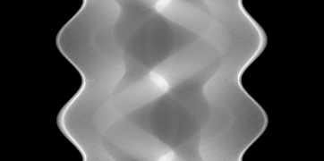
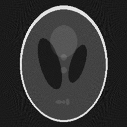
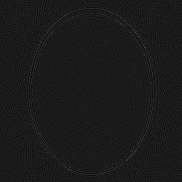

Solving a problem with ADMM
-----------------------------
We will briefly explain the `ADMM` component and go through an example. 
Note that the current capabilities of this class are limited, more features are coming soon (tm).

### `ADMM` in elsa

Alternating Direction Method of Multipliers is an algorithm which provides the grounds for solving a certain class of
problems. 
It combines the superior convergence properties of the method of multipliers along with the decomposability of
the dual ascent algorithm [1].

`ADMM` solves problems of the form

minimize $f(x) + g(z)$

subject to  $Ax + Bz = c$.

In some scenarios, it is known beforehand that the expected solutions are non-negative. Explicitly adding this 
constraint into the stated problem, it tends to improve the reconstruction results [3]. Such a behaviour is triggered by
setting the `positiveSolutionsOnly` to `true` in the construction of ADMM. Note that of this type, only problems with 
`$g(z) = \|SH(z)\|_{1, w}$` are currently supported.

A [Least Absolute Shrinkage and Selection Operator](https://www.stat.cmu.edu/~ryantibs/papers/lassounique.pdf) problem
is of the form,

minimize `$\frac{1}{2}\|Ax - b\|^{2}_{2} + \lambda \|x\|_{1}$`

`elsa` offers the `LASSOProblem` class to encapsulate such problems. Using variable splitting, this can be rewritten to

minimize `$\frac{1}{2}\|Ax - b\|^{2}_{2} + \lambda \|z\|_{1}$`

subject to $x - z = 0$.

Now we have a `SplittingProblem`. We observe that this pattern abides by the form of problems that `ADMM` can solve, in
which `$f(x) = \frac{1}{2}\|Ax - b\|^{2}_{2}$` and `$g(z)=\lambda \|z\|_{1}$`, where $A$ is the identity matrix, $B$ is
$-1$ times the identity matrix, and $c$ is the vector $0$. 
The objects of this class can be built by providing a `Functional f` and a `RegularizationTerm g`(or a vector of them), 
so we use the aforementioned $f$ and $g$.

`ADMM` then solves that problem by alternating updates of its variables. We're showing here the scaled form which we
also use.

```math
x_{k+1} = argmin_{x}(f(x) + \frac{\rho}{2} \|Ax + Bz_{k} - c + u_{k}\|^{2}_{2})
```


```math
z_{k+1} = argmin_{z}(g(z) + \frac{\rho}{2} \|Ax_{k+1} + Bz - c + u_{k}\|^{2}_{2})
```

```math
u_{k+1} = u_{k} + Ax_{k+1} + Bz_{k+1} - c
```


The selection of the regularization parameter `lambda`, which is introduced in the next section, and the coupling
parameter `rho`, is not quite straightforward. 
In this instance, we've chosen to set the value of `rho` to 1, and the
value of `lambda` to 1/2. 
It is evident that the result of `ADMM` depends on both of these. More information on this, is
provided by Wieczorek *et al.* [2].

### Solving a toy inverse problem using ADMM

We start by generating a modified 2D Shepp-Logan phantom by calling

```c++
IndexVector_t size(2);
size << 256, 256;
auto phantom = PhantomGenerator<real_t>::createModifiedSheppLogan(size);
```

This generates the following image,


We generate a circular acquisition trajectory using `CircleTrajectoryGenerator`,

```c++
index_t numAngles{180}, arc{360};
auto distance = static_cast<real_t>(size(0));
auto sinoDescriptor = CircleTrajectoryGenerator::createTrajectory(numAngles, phantom.getDataDescriptor(), arc, 
                                                                  distance * 100.0f, distance);
```

We continue by creating a projector of type `SiddonsMethod`, which utilizes the `sinoDescriptor` data descriptor above.

```c++
SiddonsMethod projector(dynamic_cast<const VolumeDescriptor&>(phantom.getDataDescriptor()), *sinoDescriptor);
```

Simulate the sinogram and write it to an [EDF](https://en.wikipedia.org/wiki/European_Data_Format) file,

```c++
auto sinogram = projector.apply(phantom);

EDF::write(sinogram, "2dsinogram.edf");
```

This generates the following sinogram,



`ADMM` requires a `SplittingProblem` to solve. 
As mentioned above, we will utilize a `LASSOProblem` object to construct
that, which requires setting up the [weighted least squares](https://en.wikipedia.org/wiki/Weighted_least_squares)
problem and the [L1 regularizer](https://en.wikipedia.org/wiki/Regularization_\(mathematics\)). 
We do that as follows,

```c++
WLSProblem wlsProblem(projector, sinogram);

real_t lambda = 0.5f;
L1Norm regFunc(projector.getDomainDescriptor());
RegularizationTerm regTerm(lambda, regFunc);
```

We continue by creating the $Ax + Bz = c$ constraint, which in our scenario is simply $x - z = 0$,

```c++
const DataDescriptor& regDatDescriptor = regTerm.getFunctional().getDomainDescriptor();

Identity idOp(regDatDescriptor); // A
Scaling<real_t> negativeIdOp(regDatDescriptor, -1); // B
DataContainer dZero(regDatDescriptor); // c
dZero = 0; // 0

Constraint constraint(idOp, negativeIdOp, dZero);
```

Now let's create the `SplittingProblem` object which utilizes the two parts and the constraint

```c++
SplittingProblem splittingProblem(wlsProblem.getDataTerm(), regTerm, constraint);
```

Finally, we build the `ADMM` solver. 
We can specify the solvers as template parameters. Note that as of currently, we
support subclasses of `Solver` and `ProximityOperator` for the first and second template respectively. We chose to
specify the [conjugate gradient](https://en.wikipedia.org/wiki/Conjugate_gradient_method) solver as `CG` along with
the [shrinkage/soft-thresholding](http://www.cs.cmu.edu/afs/cs/Web/People/airg/readings/2012_02_21_a_fast_iterative_shrinkage-thresholding.pdf#page=3)
operator as `SoftThresholding`

```c++
ADMM<CG, SoftThresholding> admm(splittingProblem);
```

We can now reconstruct the phantom! We do this simply by

```c++
index_t noIterations{10};
auto admmReconstruction = admm.solve(noIterations);
```

Writing the output in an EDF file makes the visualization easier.

```c++
EDF::write(admmReconstruction, "2dreconstruction_admm.edf");
```

After 10 iterations of ADMM, the phantom reconstruction is generated. 
From here we can do a side-by-side comparison of the original phantom and its reconstruction,




Finally, we can also create the element-wise difference image between the two by simply writing,

```c++
DataContainer phantom = EDF::read("2dphantom.edf");
DataContainer phantomRecon = EDF::read("2dreconstruction_admm.edf");

DataContainer diffImage = phantom - phantomRecon;

EDF::write(diffImage, "2ddifference_image.edf");
```

which displays the following image



### References

[1] S. Boyd, N. Parikh, E. Chu, B. Peleato and J. Eckstein. *Distributed Optimization and Statistical Learning via the 
Alternating Direction Method of Multipliers*. Foundations and Trends in Machine Learning 3(1), 2011.  
DOI: [10.1561/2200000016](http://dx.doi.org/10.1561/2200000016)

[2] M. Wieczorek, J. Frikel, J. Vogel, E. Eggl, F. Kopp, P.B. Noel, F. Pfeiffer, L. Demart, T. Lasser. *X-ray computed 
tomography using curvelet sparse regularization*. Medical Physics 42(4), 2015. 
DOI: [10.1118/1.4914368](https://dx.doi.org/10.1118/1.4914368)

[3] Tatiana A. Bubba, G. Kutyniok, M. Lassas, M. März, W. Samek and S. Siltanen, V Srinivasan. *Learning The Invisible: 
A Hybrid Deep Learning-Shearlet Framework for Limited Angle Computed Tomography*, 2018
