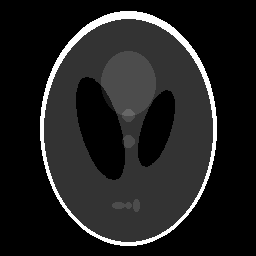

Shearlets
---------

Shearlets are a multiscale framework which provide an optimally sparse approximations of multivariate data governed by
anisotropic features [1]. They are constructed by applying three operations, translation, parabolic scaling, and
shearing to mother functions. Here, we offer band-limited cone-adapted [2] shearlets meaning that we have compact
support in the Fourier domain. For further reading regarding the exact functions used, please refer to the FFST
paper [3].

### Decompose and reconstruct an image using shearlets

We will now briefly explain the `ShearletTransform` class and go through an example.

```c++
// generate 2D phantom
IndexVector_t size(2);
size << 256, 256;
auto phantom = PhantomGenerator<real_t>::createModifiedSheppLogan(size);

ShearletTransform<real_t, real_t> shearletTransform(size);

Logger::get("Info")->info("Applying shearlet transform");
DataContainer<real_t> shearletCoefficients = shearletTransform.apply(phantom);

Logger::get("Info")->info("Applying inverse shearlet transform");
DataContainer<real_t> reconstruction = shearletTransform.applyAdjoint(shearletCoefficients);

// write the reconstruction out
EDF::write(reconstruction, "2dreconstruction_shearlet.edf");
```

We start by generating a modified 2D Shepp-Logan phantom and create a `ShearletTransform` object. Afterwards, we apply
the direct shearlet transform to the image, which generates a `DataContainer<real_t>` of shape (256, 256, 61). The last
dimension corresponds to the oversampling factor of the operatio. Here, we generate 61 layers.

Note that `apply` works only on two-dimensional objects, e.g. on a grayscale image.

By default, the `apply` method will return real values, and the imaginary parts cut out. If we want to the complex
numbers as-generated, then we can simply specify `ShearletTransform<std::complex<real_t>, real_t>`, and go from there.

As a subclass of the `LinearOperator` class, the `ShearletTransform` does not eagerly perform computations. Therefore,
the spectra are stored right after they've been generated on the first run of the `apply`/`applyAdjoint` calls. This
avoids redundant computation.

Given that the spectra are only related to the shape of the image and number of scales, one can reuse such an object
depending on the context.

After applying the direct and inverse shearlet transform, the phantom reconstruction is generated. From here we can do a
side-by-side comparison of the original phantom and its reconstruction,




### References

[1] Gitta Kutyniok and Demetrio Labate, *Introduction to Shearlets*, https://www.math.uh.edu/~dlabate/SHBookIntro.pdf.

[2] Kanghui Guo, Gitta Kutyniok, and Demetrio Labate, *Sparse Multidimensional Representations using Anisotropic
Dilation and Shear Operators*, ISBN 0-0-9728482-x-x, https://www.math.uh.edu/~dlabate/Athens.pdf.

[3] Sören Häuser, Gabriele Steidl, *Fast Finite Shearlet Transform: a tutorial*, https://arxiv.org/pdf/1202.1773.pdf.
