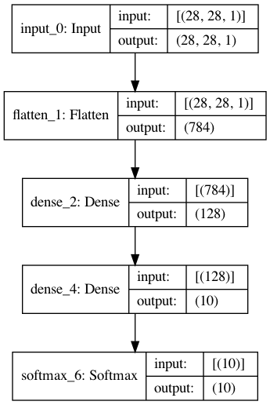

.. _elsa-ml-first-example:

***************
Getting started
***************

.. contents:: Table of Contents

A first example
===============

Let's start with a first example and build a network to learn the famous
`MNIST <http://yann.lecun.com/exdb/mnist/>`_ task which consists of 60.000
images of handwritten digits with height and width both 28.

We start by defining a VolumeDescriptor describing the input shape of a single
MNIST image and then define our first network layer.

.. code-block:: cpp

  VolumeDescriptor inputDescriptor{{28, 28, 1}};

  auto input = ml::Input(inputDescriptor, /* batch-size */ 10);

In this first example we design a fully-connected network. We must therefore
flatten our input using a Flatten layer. We set the input of ``flatten`` to be
our input layer defined above;

.. code-block:: cpp

  auto flatten = ml::Flatten();
  flatten.setInput(&input);

Let's add a Dense layer and set the input. The Dense layer is defined by
specifying the number of neurons (128 in this case) and the activation function.
Again, we set the input of ``dense`` to be ``flatten``.

.. code-block:: cpp

  // A dense layer with 128 neurons and Relu activation
  auto dense = ml::Dense(128, ml::Activation::Relu);
  dense.setInput(&flatten);

Finally we add a second Dense layer, followed by a Softmax layer:

.. code-block:: cpp

  // A dense layer with 10 neurons and Relu activation
  auto dense2 = ml::Dense(10, ml::Activation::Relu);
  dense2.setInput(&dense);

  auto softmax = ml::Softmax();
  softmax.setInput(&dense2);

Now it's time to construct a Model out of the layers above which works just by
specifying the input and output of our network

.. code-block:: cpp

  auto model = ml::Model(&input, &softmax);

Sequential Networks
===============

Since our fully-connected network above consists of layers with at most one
input and at most one output we call such a network *sequential*, again following
Keras's naming convention.

In the case of a sequential network we have an easier way to build out model.
The above network can also be constructed by the following snippet:

.. code-block:: cpp

  auto model = ml::Sequential(ml::Input(inputDesc, /* batch-size */ 1),
                              ml::Dense(128, ml::Activation::Relu),
                              ml::Dense(10, ml::Activation::Relu),
                              ml::Softmax());

Graphs and pretty printing
===============

While constructing a model, elsa defines an internal graph representation of the
network. Observing this graph can be helpful. Elsa exports network graphs in 
`Graphviz' DOT language <https://graphviz.org/doc/info/lang.html>`_:

.. code-block:: cpp

  ml::Utils::Plotting::modelToDot(model, "myModel.dot");

By using e.g.

.. code-block::  bash

  $ dot -Tpng myModel.dot > myModel.png

the network model defined in the previous section is plotted as

Another possibility to observe the architecture of a model is to just print the
model to console:

.. code-block:: cpp

  std::cout << model << "\n";

In our example this would result in

.. code-block:: none

  Model:
  ________________________________________________________________________________
  Layer (type)                       Output Shape        Param #   Connected to
  ================================================================================
  input_0 (Input)                    (28,  28,   1)      0         flatten_1
  ________________________________________________________________________________
  flatten_1 (Flatten)                (784)               0         dense_2
  ________________________________________________________________________________
  dense_2 (Dense)                    (128)               100480    dense_4
  ________________________________________________________________________________
  dense_4 (Dense)                    (10)                1290      softmax_6
  ________________________________________________________________________________
  softmax_6 (Softmax)                (10)                0
  ================================================================================
  Total trainable params: 101770
  ________________________________________________________________________________

Compiling a model
===============

So far we only defined what we call a front-end model. To really do something
meaningful we need to compile the model. This is also the point where we 
set the loss function we want to use as well as the optimizer.

While compiling a model elsa performs a lot of detail work under the hood. In
particular backend resources get allocated.

Let's compile our toy MNIST model with a SparseCategoricalCrossentropy loss
and the well known Adam optimizer:

.. code-block:: cpp

  // Define an Adam optimizer
  auto opt = ml::Adam();

  // Compile the model
  model.compile(ml::SparseCategoricalCrossentropy(), &opt);

After the model is compile we are ready for training or inference.

Train a model
===============

Training a model is straight forward and most of the work will be preparing 
training data which is of course independant of elsa. Assume we bundled our 
MNIST images into a ``std::vector<DataContainer>`` ``inputs`` and our labels
into ``labels`` respectively. 

Following Keras we can traing our model as easy as

.. code-block:: cpp

  model.fit(inputs, labels, /* epochs */ 10);
