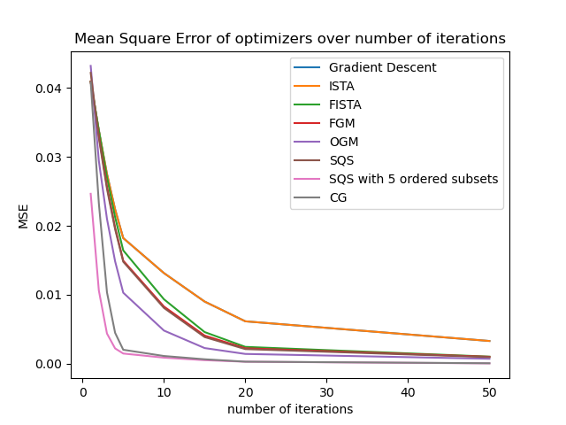
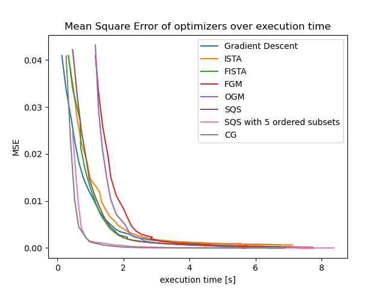

.. _elsa-solvers-choosing-a-solver:

******************
Choosing a Solver
******************

.. contents:: Table of Contents

A first example
===============

This guide assumes you have read the :ref:`Quickstart Guide <guides/quickstart-cxx:Quickstart>` or are already familiar with elsa.

A typical reconstruction pipeline in elsa looks like follows.
We would have a volume descriptor for some given 2d or 3d volume defining the
are to be reconstructed as well as a detector descriptor that describes the trajectory
of our measurement positions. Finally we also have a sinogram that contains the actual
measurement data.

.. code-block:: cpp

  VolumeDescriptor volumeDescriptor;
  DataContainer sinogram;
  PlanarDetectorDescriptor sinoDescriptor;
  SiddonsMethod projector(volumeDescriptor, sinoDescriptor);

To compute a reconstruction we would construct an optimisation problem, typically
a weighted least squares problem ``WLSProblem`` which we would then solve using an iterative
optimisation method (e.g. Gradient Descent) to get the actual reconstructed image.

.. code-block:: cpp

  WLSProblem wlsProblem(projector, sinogram);
  GradientDescent solver(problem);
  auto reconstruction = solver.solve(20);

Since there are multiple options for optimisation methods available in elsa choosing the
right solver for the task is quite important.

Solver Options
===============

The following table should be regarded as an overview over what solvers exists in elsa and what their rough properties are.
The stated convergence speeds should be taken with a grain of salt as they are evaluated on general problems
(see the later sections) and can differ when specific solvers are applied to more specialized problems.

+----------------------------------------------------------+-------------------------------------------------------+-------------+
| Solver                                                   | Requirements on the problem                           | Convergence |
+==========================================================+=======================================================+=============+
| Gradient Descent (GD)                                    | None                                                  | Slow        |
+----------------------------------------------------------+-------------------------------------------------------+-------------+
| Nesterov's Fast Gradient Method (FGM)                    | None                                                  | Medium      |
+----------------------------------------------------------+-------------------------------------------------------+-------------+
| Optimized Gradient Method (OGM)                          | None                                                  | Medium      |
+----------------------------------------------------------+-------------------------------------------------------+-------------+
| Separable Quadratic Surrogate Ordered Subsets (SQS OS)   | None                                                  | Fast        |
+----------------------------------------------------------+-------------------------------------------------------+-------------+
| Conjugate Gradient Descent (CGLS)                        | Problem must be convertible to a quadric problem      | Fast        |
+----------------------------------------------------------+-------------------------------------------------------+-------------+
| Proximal Gradient Descent (PGD)                          | Requires a regularization term                        | Medium      |
+----------------------------------------------------------+-------------------------------------------------------+-------------+
| Accelerated Proximal Gradient Descent (APGD)             | Requires a regularization term                        | Medium      |
+----------------------------------------------------------+-------------------------------------------------------+-------------+
| Alternating Direction Method of Multipliers (ADMM)       | <WIP>                                                 | <WIP>       |
+----------------------------------------------------------+-------------------------------------------------------+-------------+

For a more detailed description on the internals of each solvers also see the :ref:`API documentation <elsa-solvers-api>`.
To learn more about how to use ordered subsets and specifically SQS OS read the :ref:`Ordered Subsets Introduction <elsa-solvers-ordered-subsets>`.

Solver Convergence
==================
This section will take a closer look at the convergence speed of the different solvers for a simple phantom reconstruction
problem. The ADMM solver will be excluded here as it requires some special tweaking and cannot be compared to the other solvers
as easily.

To compare the convergence speed of the elsa solvers we set up a simple 2D 128 x 128 phantom reconstruction problem.
We run each solver for a number of iterations and plot the Mean Square Error of the reconstruction compared to the ground truth
over the number of iteration. The code containing these experiments can be found
`here <https://gitlab.lrz.de/IP/elsa/-/blob/master/examples/solver_experiments.py>`_.
The SQS solver is plotted both in its ordered subset mode and in normal mode where it is roughly equivalent to the Nesterov's Fast Gradient Method.

As we can see the main winners of this experiment are Conjugate Gradient Descent (CG) and SQS in ordered subset mode (SQS OS).
The only other solver coming somewhat close in terms of convergence speed by number of iterations is the Optimized Gradient Method (OGM).
Since the computational complexity of the solvers differs quite a bit we also need to have a look at how fast they converge
when measured in terms of run time.

Time complexity
==================

To measure the actual time-based convergence speed of the different solvers we again run the same experiment using
a sample 2D 128 x 128 phantom reconstruction. We run each solver for a number of iterations up to 50 and plot the
Mean Square Error of the reconstruction over the actual execution time of the optimization process.

    Note: the irregularities stem from running the timing experiment on a normal multi-threaded desktop pc

This experiment now paints a slightly different picture of the actual convergence speeds than the previous one.
Again the SQS OS and CG have the fastest convergence speed but the main surprise comes when looking at the FGM and OGM
solvers which have a very high convergence speed when measured in the number of required iterations. When only measuring
the execution time both of those solver have a slow initial convergence speed but do catch up to the other medium speed
solvers after some time. This is due to the fact that both of these solvers have a more expensive implementation than
other first order methods (e.g. Gradient Descent) while having better convergence properties. OGM even is proven to reach
the theoretical maximum convergence speed for first order solvers.

As a rule of thumb we can conclude that using either CG or SQS OS for general reconstruction problems in elsa will
yield the best results. In case of more specialized problems using a solver that is specifically designed for such
problems might be more desirable though.

