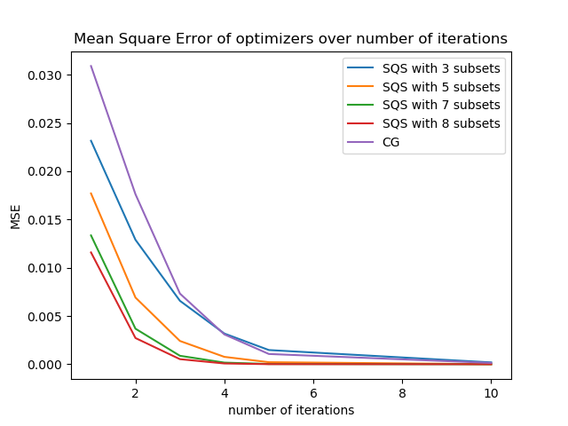
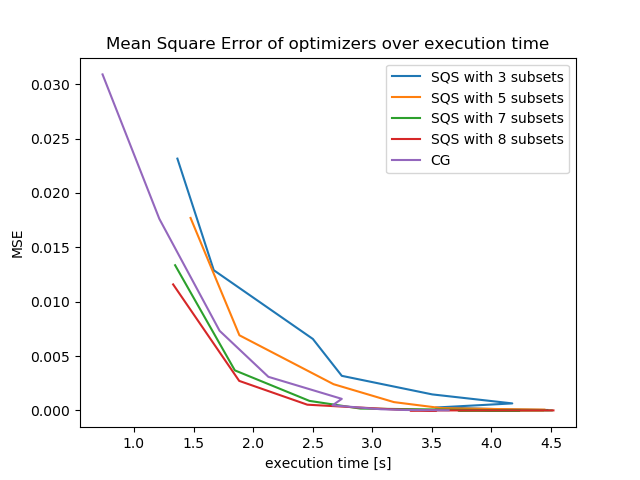

.. _elsa-solvers-ordered-subsets:

******************
Ordered Subsets
******************

.. contents:: Table of Contents

Introduction
===============

The elsa problem and solvers API supports solvers using ordered subsets to achieve faster initial convergence speeds.

    Note: the only solver which currently implements ordered subsets is the Separable Quadratic Surrogate (SQS) method.

First order solvers using ordered subset function similarly to stochastic gradient descent. Instead of operating on the
full input data the solver computes the gradients needed for its update step only on a subset (or batch in SGD terminology) of the input data.
This process of reducing the amount of data used in the gradient computation can greatly increase initial convergence speeds.
One essential aspect of using OS methods for tomographic reconstruction problems is the process of sampling the initial
input data into subsets as one requirement of OS methods is the approximate equivalence of the gradient of the full problem with the
gradient of the ordered subsets. Since tomographic measurement data has some inherent structure stemming from the geometry of the
detector and the detector poses during measurement the subset sampling process should yield subsets whose measurement geometry
approximates that of the full measurement data.

To use ordered subsets in elsa we would start with our normal reconstruction input of a 2D or 3D volume descriptor,
a data container with the measurement data and a detector descriptor containing the measurement geometry and trajectory.

.. code-block:: cpp

    VolumeDescriptor volumeDescriptor;
    DataContainer sinogram;
    PlanarDetectorDescriptor sinoDescriptor;

Instead of now directly instantiating a ``WLSProblem`` with the descriptors and a projector we first need to divide
our input data into subsets. This is done by instantiating a ``SubsetSampler`` and pass it the number of subsets we want.

    Note: we also need to pass the type of detector descriptor as a template parameter due to some implementation internals.

.. code-block:: cpp

    index_t nSubsets{4};
    SubsetSampler<PlanarDetectorDescriptor, real_t> subsetSampler(
        volumeDescriptor, sinoDescriptor, nSubsets);

After instantiating our subset sampler we can then create a ``WLSSubsetProblem`` which we can pass to a solver which
supports ordered subsets. The solvers will check whether they received a ``SubsetProblem`` and automatically
run in ordered subsets mode. The API of a ``SubsetProblem`` also supports its usage as a normal ``Problem`` but will
not yield any benefits from its subset processing.

.. code-block:: cpp

    WLSSubsetProblem<real_t> problem(
        *subsetSampler.getProjector<SiddonsMethod<real_t>>(),
        subsetSampler.getPartitionedData(sinogram),
        subsetSampler.getSubsetProjectors<SiddonsMethod<real_t>>());
    SQS solver{problem};
    auto reconstruction = solver.solve(20);

Sampling Strategies
===================

The ``SubsetSampler`` API provides several strategies to generate subsets from input data to accommodate for
different measurement trajectories and detector geometries in order to keep the subset gradients approximately equal.
The desired sampling strategy can simply be passed as an argument to the ``SubsetSampler`` constructor.

Currently there are two strategies implemented available as enums in ``SubsetSampler::SamplingStrategy``:

+---------------------------+--------------------------------------------------------------------+
| Strategy                  | Description                                                        |
+===========================+====================================================================+
| ``ROUND_ROBIN``           | | a simple round robin based splitting (the default method), may   |
|                           | | not work well for more complex 3D trajectories                   |
+---------------------------+--------------------------------------------------------------------+
| ``ROTATIONAL_CLUSTERING`` | | tries to assign data points to subsets based on their rotational |
|                           | | distance such that each subset approximates the geometry of the  |
|                           | | full measurement data                                            |
+---------------------------+--------------------------------------------------------------------+

Convergence
===========

A comparison between the convergence of SQS OS and most other solvers in elsa can be found in the :ref:`Solvers Overview <elsa-solvers-choosing-a-solver>`.

One very tunable parameter when using ordered subset solvers is the number of subsets. Generally the more subsets used
during the optimization the faster the initial convergence speed will be. The limit to how many subsets can and should
be used for a given problem is given by the number of measurement data points.

To get a rough understanding of how the SQS OS method performs when tweaking the number of subsets we evaluated a small
3D 32 x 32 x 32 phantom reconstruction problem. The code for these experiments can be found
`here <https://gitlab.lrz.de/IP/elsa/-/blob/master/examples/solver_experiments.py>`_.

As we can see increasing the number of subsets generally improves the convergence speed in terms of the number of iterations
needed. The same holds true for the actual execution time needed to achieve a certain accuracy as the next plots shows.

    Note: the irregularities stem from running the timing experiment on a normal multi-threaded desktop pc

Increasing the number of subsets used can greatly improve the actual convergence speed of an ordered subsets based solver.
In practice some experimentation might be needed to find the maximum number of subsets usable for the given problem and
input data set, as a too small number of data points per subset might lead to unstable convergence.